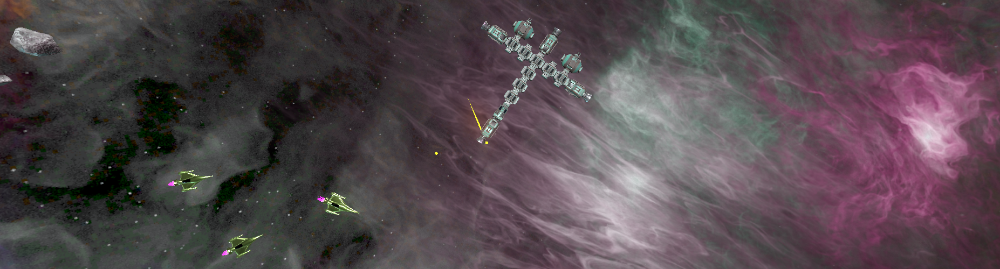
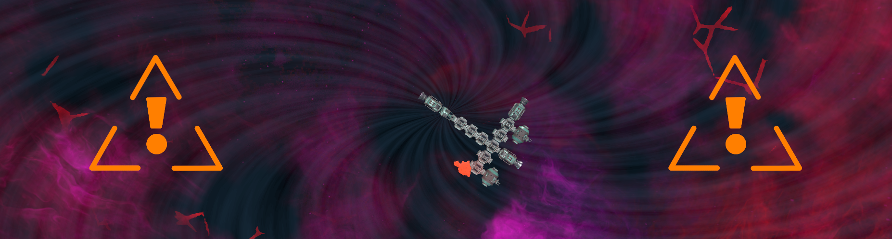
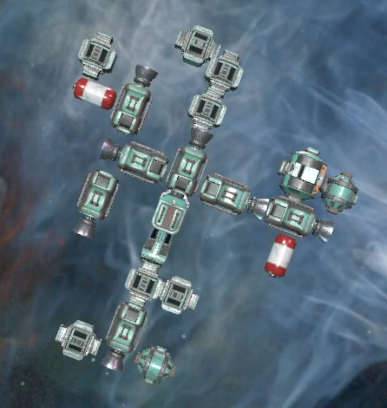
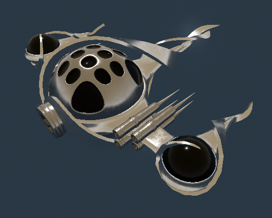

---
hide:
  - toc
---

# Roguelike w kosmosie, sterowanie w twoich rękach

Faster Than Scrap to gra typu rougelike w której wcielasz się w kosmicznego inkwizytora mającego na celu powstrzymanie kultystów przed zniszczeniem świata. Na twojej drodze stoją zarówno groźni kosmici, jak również twoja własna klawiatura.

# Wir pochłania świat

Kultyści otworzyli bramę do innego wymiaru przyzywając niszczący wszystko wir. Ucieknij, zanim cię pochłonie!

# Stwórz swój wymarzony statek

<video controls>
    <source src="assets/building.webm" type="video/mp4">
</video>

{ align=right width="320"}

Skorzystaj z szerokiego asortymentu części aby zbudować swój wymarzony statek. Skorzystaj m. in. z:

- laserów i pocisków
- tarczy
- silników manewrowych

...i wiele innych!

!!! Tip "Unikalna mechanika FTS"
    Każda dodana część zmienia sterowanie! Zaplanuj dobrze co wchodzi w skład twojego statku.

# Powstrzymaj kultystów

{ align=right }

Do uszu Lorda Inkwizytora Hellingtona, nadzorującego sektor Anterius podlegający Imperium, informacje o charytatywnej działalności grupy Seraku dotarły 13 lat standardowych temu. W opinii publicznej zaistnieli kilka lat później.

Z upływem czasu grupa Seraku zaczynała coraz bardziej przypominać kult, słyszało się o wyższych członkach organizacji oddających się okultystycznym praktykom. Praktykom z rodzaju wykluczonych z Aktu o Wolności Religijnej, lub nawet łamiących cywilne prawo karne.

Pod wpływem tych wydarzeń jesteś wysłany by zbadać ich działalność. Niestety na miejscu okazało się, że jest za późno - tajemnicza sfera, rana w miękkiej tkance rzeczywistości, została otwarta. Teraz uwolniona z kontroli pożartych przez nią kultystów rozrywa wrak stacji na strzępy, a gracz tutaj zaczyna swoją ucieczkę.
